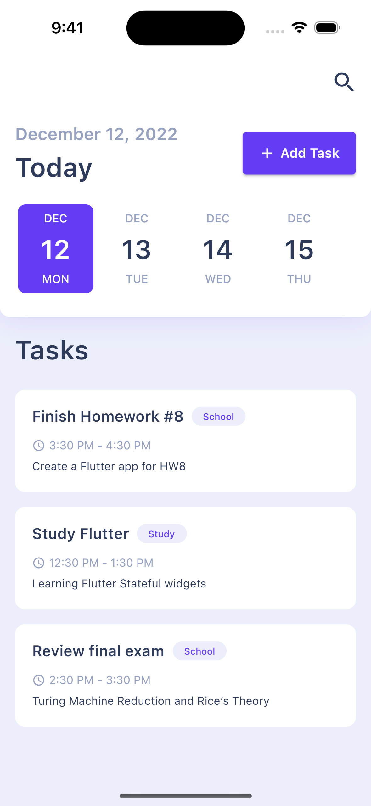
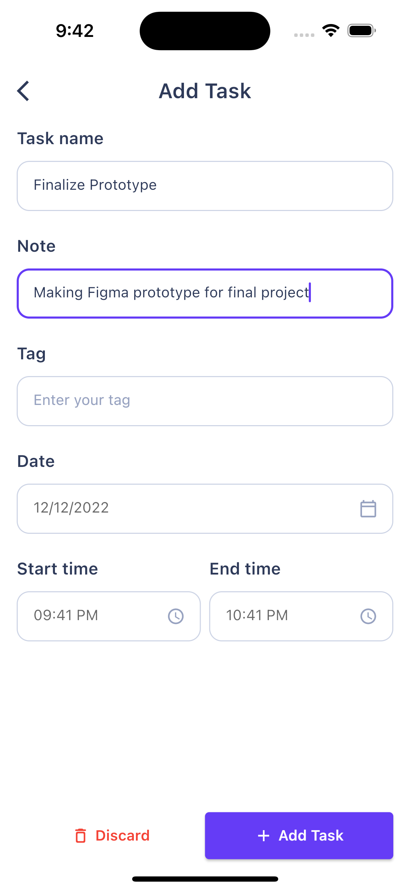

# taskit (ASE 456 Final Project)

## Overview

taskit is a personal time-management application that helps students to record tasks and track their time.

## User stories
- As a student, I want to record my tasks so that I can keep track of time usage.
    - As a user, I want click on the "Add Task" button to open a dialog box with multiple TextFields so that I enter all information related to a task.
    - As a user, I want to enter *DATE* by opening a date picker so that I do not have to enter it myself or worry about date format.
    - As a user, I want to enter time to the *FROM* and *TO* by opening a time picker so that I do not have to enter it myself or worry about time format.
    - As a user, I want to open a dialog box so that I can enter the *TASK* that I did.
    - As a user, I want to open a dialog box so that I can organize my task by using *TAG*.
- As a student, I want to have a feature that allows me to look up the tasks from the history so that I can see what tasks I have completed.
    - As a user, I want the app to display all tasks I logged so that I can see all tasks that I finished today.
    - As a user, I want to enter my query into a search bar and the application displays the tasks that are related so that I can look for tasks that I finished.

## Tools

- IntelliJ will be used to develop this application.
- This application will be developed in iOS using Flutter
- Git repository can be found [here](https://github.com/jasoncao-dev/taskit)

## UI Design

- Main app
  

- Add task form
  


## Structure data
- Firebase schema
  ```javascript
  {
    id: id(), // auto generated id
    name: string,
    tag: string,
    note: string,
    date: string,
    startTime: string,
    endTime: string
  }
  ```
- Sample data
  ```json
    {
        "id": "absCJNmmtFxtDwDXawfo",
        "name": "Learn Flutter",
        "note": "Learn how to build stateful widget",
        "tag": "Study",
        "date": "12/12/2022",
        "startTime": "11:30 AM",
        "endTime": "12:30 PM"
    }
    ```
## How to implement?
- Tasks are objects with id, name, tag, date, startTime, and endTime.
- Tasks are stored in a list of type `Task`.
- Widgets needed for the project: ListView, TextInput, AppBar Search, DateTime picker, etc.
- First activity shows list of tasks by fetching Firebase database with query's parameter is today's date while the view shows "Fecthing your tasks...".
- If no tasks are found, display "No tasks to show".
- When clicking the search icon, the search type text field opens up. User input is then passed to TaskList to render tasks with query as substring with task's name or task's tag, etc.
