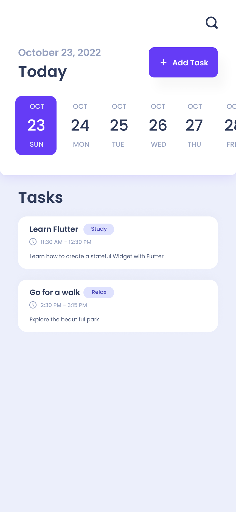

# Prototype

### Tools

- `IntelliJ` will be used to develop this application.
- This application will be developed for `iOS` using Flutter
- Git repository can be found [here](https://github.com/jasoncao-dev/taskit)

### UI Design

- Main app 


- Add task form


### Structure data
- Firebase schema
  ```javascript
  {
    id: id(), // auto generated id
    name: string,
    note: string,
    tag: string,
    date: timestamp,
    startTime: timestamp,
    endTime: timestamp
  }
  ```
- Sample data
  ```json
    {
        "id": "absCJNmmtFxtDwDXawfo",
        "name": "Learn Flutter",
        "note": "Learn how to build stateful widgets",
        "tag": "Study",
        "date": "12/12/2022",
        "startTime": "11:30 AM",
        "endTime": "12:30 PM"
    }
    ```
### How to implement?
- Tasks are objects with id, name, note, tag, date, startTime, and endTime.
- Widgets needed for the project: ListView, TextInput, AppBar Search, DateTime picker, etc.
- First activity shows list of tasks by fetching Firebase database with query's parameter is today's date while the view shows `CircularProgressIndicator`.
- If no tasks are found, display "No tasks to show".
- When clicking the search icon, the search type text field opens up with a dropdown that allows users to find tasks based on name, note, or tag.
